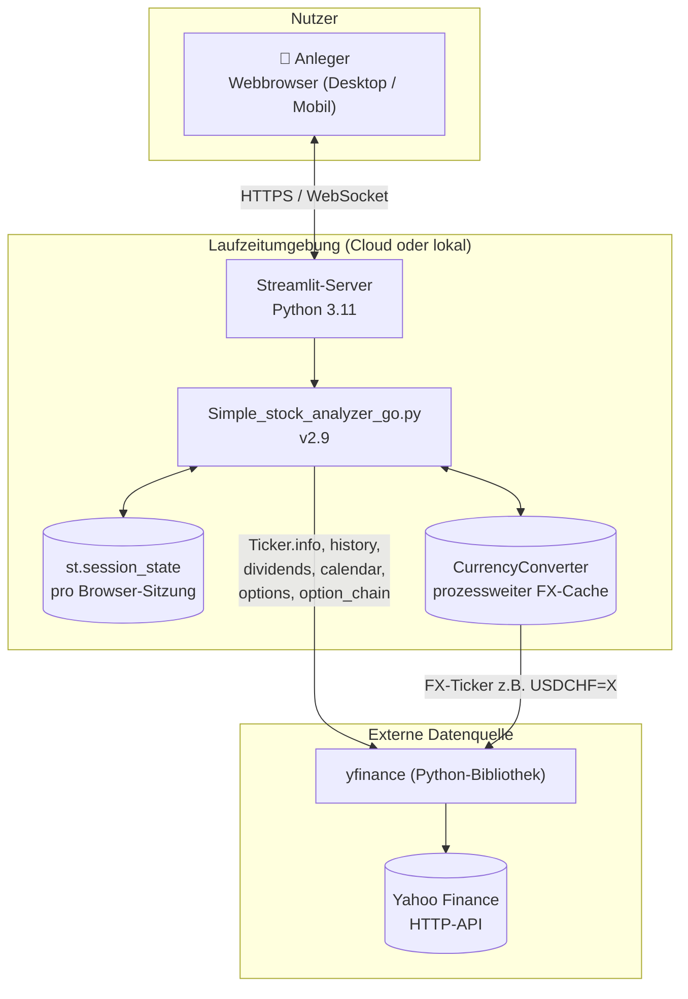
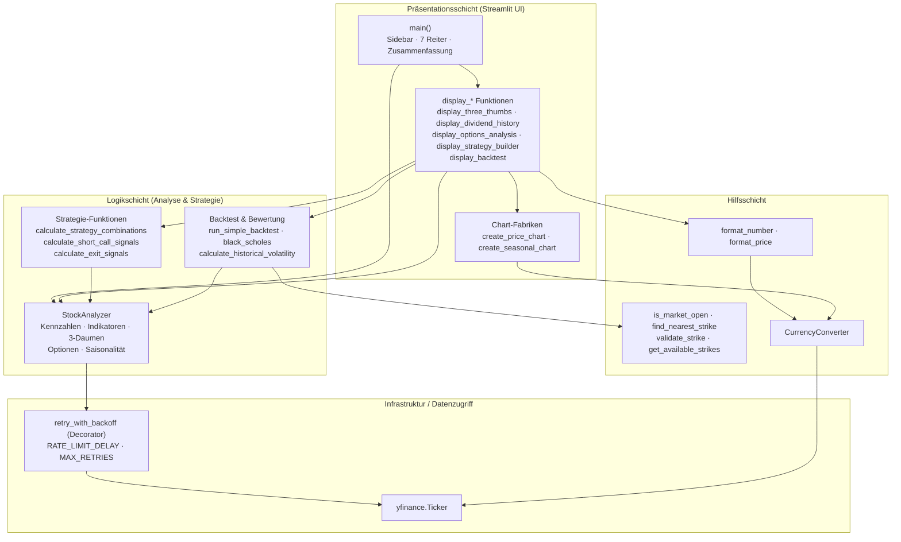
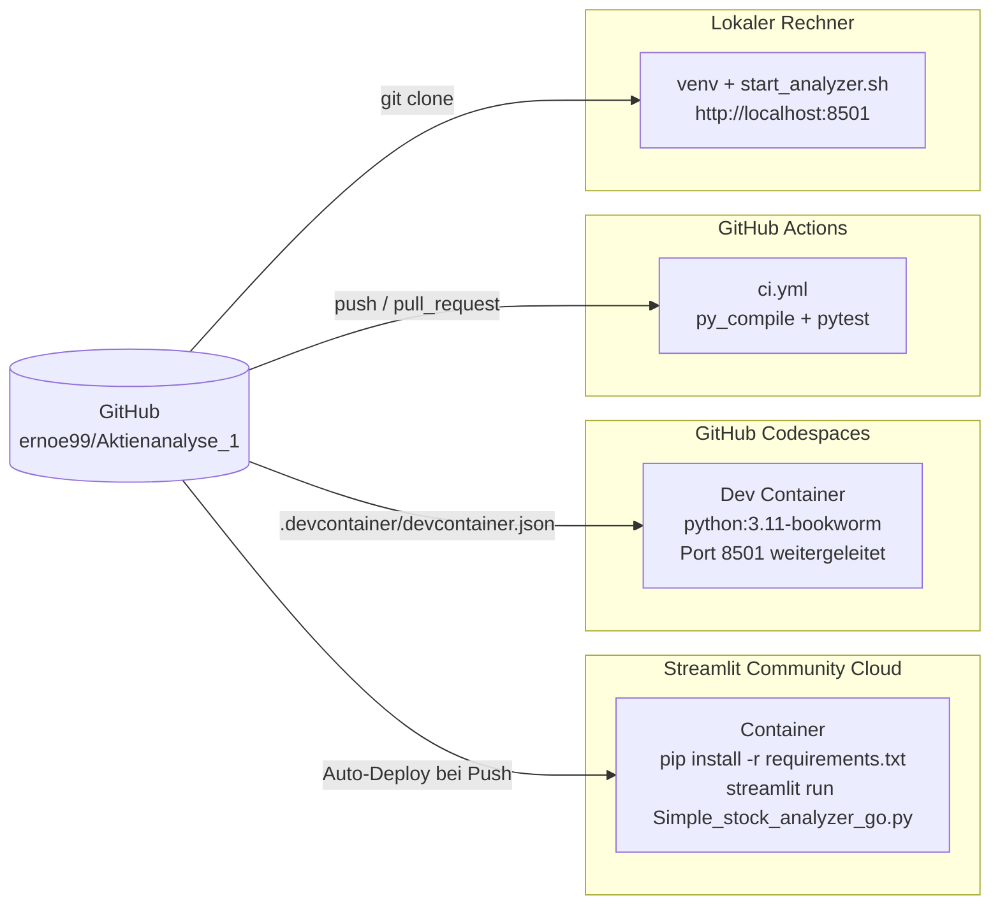
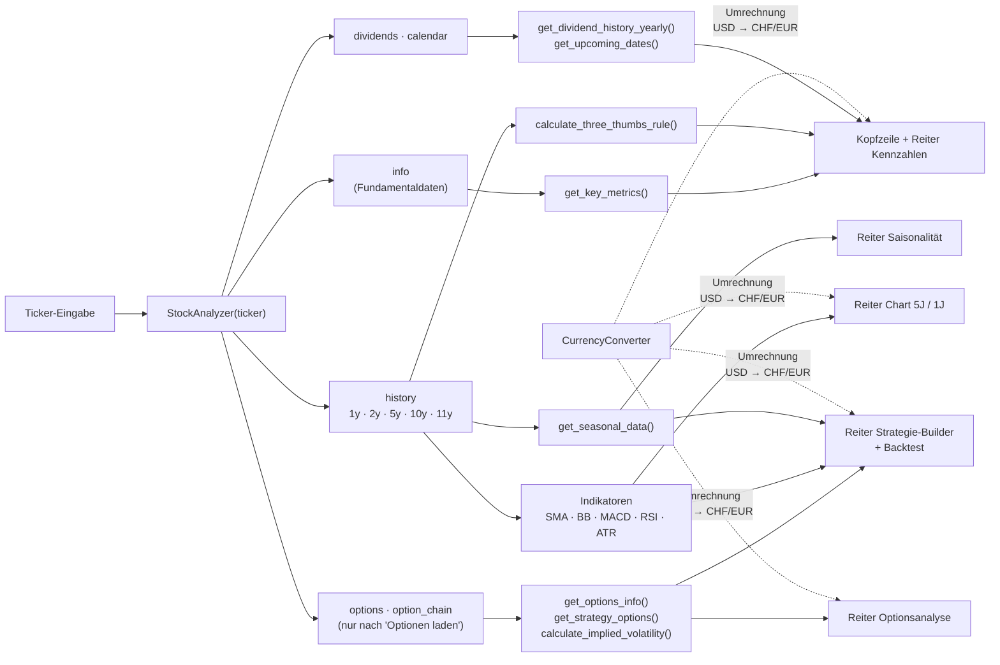
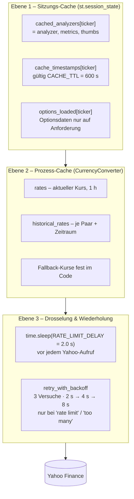

# 1. Systemarchitektur

## 1.1 Zweck des Systems

Das Tool unterstützt eine **Optionenstrategie zur Rentenergänzung** mit ca. 7-fachem Hebel. Es analysiert
Aktien und ETFs, bewertet sie mit der **3-Daumen-Regel**, stellt technische Charts dar und berechnet
eine **4-Bein-Optionskombination** inklusive Backtest:

| Bein | Richtung | Laufzeit | Zweck |
|---|---|---|---|
| 🔵 Long Call | Kauf | 6–12 Monate | Partizipation an Kurssteigerungen, Absicherung verkaufter Calls |
| 🔴 Short Put | Verkauf | 12–24 Monate | Basisposition, Prämieneinnahme |
| 🟡 Hedge Put | Kauf | 3–6 Monate | Absicherung des verkauften Puts |
| 🟢 Short Call | Verkauf | wöchentlich | Laufende Prämie auf ca. 50 % der Basispositionen |

## 1.2 Systemkontext

Das System ist **zustandslos gegenüber der Außenwelt**: Es gibt keine Datenbank, keine Benutzerkonten
und keine Secrets. Alle Daten werden bei Bedarf von Yahoo Finance geladen und im Speicher gecacht.

## 1.3 Schichtenmodell

Die Anwendung ist eine einzelne Python-Datei, logisch aber in vier Schichten gegliedert:

## 1.4 Deployment-Varianten

| Variante | Einstieg | Konfiguration | Geeignet für |
|---|---|---|---|
| Streamlit Community Cloud | `Simple_stock_analyzer_go.py` | `requirements.txt`, `.streamlit/config.toml` | Dauerhafter Betrieb, Zugriff von überall |
| GitHub Codespaces | automatisch per `postAttachCommand` | `.devcontainer/devcontainer.json` | Entwicklung im Browser |
| Lokal (Linux/macOS) | `./start_analyzer.sh [port]` | `requirements.txt` | Offline-Entwicklung, eigene IP (weniger Rate-Limits) |
| CI | `.github/workflows/ci.yml` | `tests/` | Qualitätssicherung bei jedem Push |

Details: [05_Cloud_Deployment.md](05_Cloud_Deployment.md).

## 1.5 Datenfluss einer Analyse

## 1.6 Caching und Rate-Limiting-Architektur

Yahoo Finance begrenzt die Anzahl Anfragen pro IP. Auf Streamlit Cloud teilen sich viele Apps
dieselben ausgehenden IP-Adressen, daher ist der Schutz dort besonders wichtig.

| Mechanismus | Wo | Wirkung |
|---|---|---|
| Sitzungs-Cache | `main()` | Erneutes Rendern nutzt dasselbe `StockAnalyzer`-Objekt (keine neue `info`-Abfrage) |
| Getrenntes Laden der Optionen | Button **⚡ Optionen laden** | Optionsketten (bis zu 9 Abfragen) werden erst auf Wunsch geladen |
| FX-Cache | `CurrencyConverter` | Wechselkurse werden prozessweit wiederverwendet |
| Drosselung | `RATE_LIMIT_DELAY` | Mindestabstand zwischen Anfragen |
| Exponentielles Backoff | `retry_with_backoff` | Automatischer Neuversuch bei Rate-Limit-Fehlern |

> **Hinweis:** Der Sitzungs-Cache speichert das Analyzer-Objekt, **nicht** die Kurshistorien und
> Optionsketten. Diese werden bei jedem Neuaufbau der Seite (jede Widget-Interaktion) erneut geladen.
> Siehe [Software Design – Bekannte Einschränkungen](02_Software_Design.md#28-bekannte-einschränkungen-und-verbesserungspotenzial).

## 1.7 Technologie-Stack

| Komponente | Bibliothek | Mindestversion | Verwendung |
|---|---|---|---|
| Web-UI | `streamlit` | 1.28 | Oberfläche, Widgets, Session State, Tabs |
| Marktdaten | `yfinance` | 0.2.31 | Kurse, Fundamentaldaten, Dividenden, Optionsketten, FX |
| Datenverarbeitung | `pandas`, `numpy` | 2.0 / 1.24 | Zeitreihen, Indikatoren, Aggregationen |
| Charts | `plotly` | 5.18 | Interaktive Kerzen-/Linien-Charts, Subplots |
| Statistik | `scipy` | 1.11 | Normalverteilung `norm.cdf` für Black-Scholes |
| Zeitzonen | `pytz` | 2023.3 | US-Eastern-Zeit für Börsenöffnungszeiten |
| Laufzeit | Python | 3.11 empfohlen (≥ 3.9) | |
