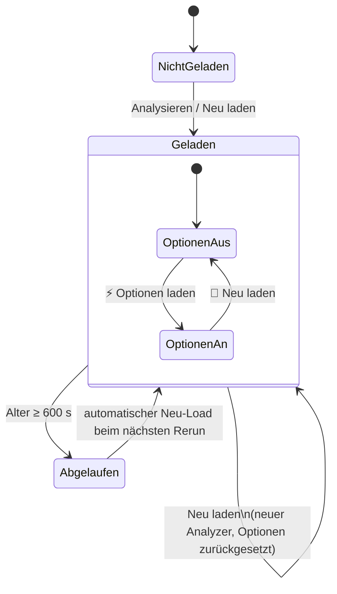
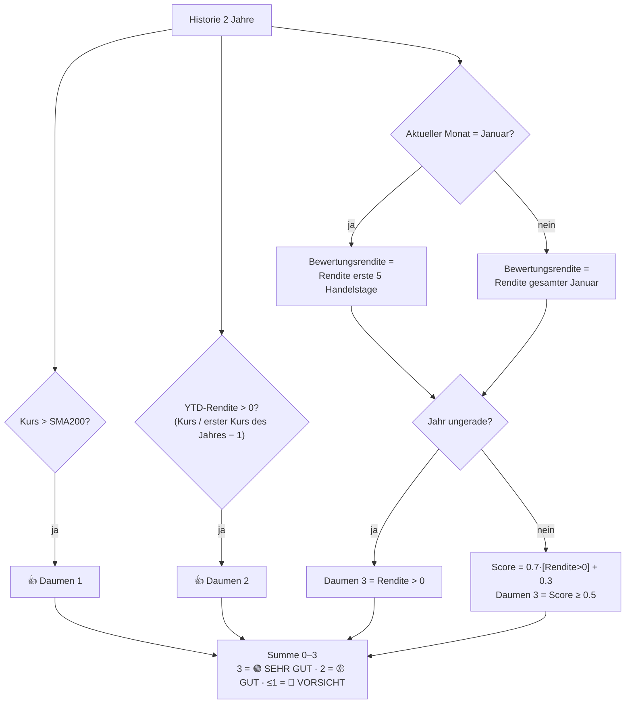
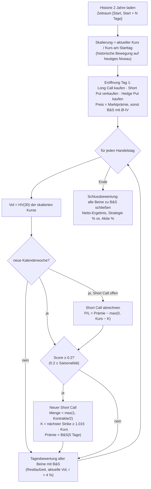

# 2. Software Design

## 2.1 Aufbau der Quelldatei

`Simple_stock_analyzer_go.py` (≈ 4100 Zeilen) ist bewusst eine **einzelne Datei**, damit sie ohne
Paketstruktur auf Streamlit Cloud, in Codespaces oder per Kopie lokal lauffähig ist.

| Zeilen (ca.) | Abschnitt | Inhalt |
|---|---|---|
| 1–75 | Kopf | Imports, `st.set_page_config`, CSS-Klassen (`metric-card`, `strategy-box`, `positive`/`negative`/`neutral`) |
| 76–117 | Rate Limiting | Konstanten `RATE_LIMIT_DELAY`, `MAX_RETRIES`, `CACHE_TTL`; Decorator `retry_with_backoff` |
| 119–328 | `CurrencyConverter` | Aktuelle und historische Wechselkurse, globale Instanz `currency_converter` |
| 331–1087 | `StockAnalyzer` | Datenzugriff, Kennzahlen, Indikatoren, 3-Daumen-Regel, Optionen, Saisonalität |
| 1089–1149 | Formatierung | `format_number`, `format_price` |
| 1151–1459 | Charts | `create_price_chart`, `create_seasonal_chart` |
| 1461–2093 | Anzeige | `display_three_thumbs`, `display_dividend_history`, `display_options_analysis`, `generate_summary` |
| 2096–2499 | Strategie-Builder-Logik | `calculate_strategy_combinations`, `calculate_short_call_signals`, `calculate_exit_signals` |
| 2503–2652 | Bewertung & Hilfen | `black_scholes`, `calculate_historical_volatility`, Strike-Hilfen, `is_market_open` |
| 2654–3095 | Backtest | `run_simple_backtest`, `display_backtest` |
| 3098–3531 | UI Strategie-Builder | `display_strategy_builder` |
| 3537–4105 | Hauptprogramm | `main()` |

## 2.2 Designprinzipien und Entscheidungen

| Entscheidung | Begründung | Konsequenz |
|---|---|---|
| **Streamlit** als UI | Reines Python, kein Frontend-Code, kostenloses Cloud-Hosting | Skript wird bei jeder Interaktion komplett neu ausgeführt (Rerun-Modell) |
| **yfinance** als einzige Datenquelle | Kostenlos, kein API-Key, deckt Kurse/Fundamentals/Optionen ab | Inoffizielle API, Rate-Limits, Feldnamen können sich ändern |
| **Fassade `StockAnalyzer`** | Kapselt alle Zugriffe auf `yf.Ticker` für einen Ticker | UI-Funktionen kennen yfinance nicht direkt |
| **Reine Funktionen für Strategie-Logik** | Gut testbar, unabhängig von der UI | Ergebnisse als `dict`, Darstellung in separaten `display_*`-Funktionen |
| **Trennung Berechnen ↔ Anzeigen** | `calculate_*` / `run_*` liefern Daten, `display_*` rendert | Logik kann ohne Streamlit wiederverwendet werden |
| **Optionsdaten nur auf Anforderung** (v2.9) | Optionsketten sind die teuersten Abfragen | Reiter 6 und 7 zeigen erst nach Klick auf „Optionen laden“ Inhalte |
| **Defensive Fehlerbehandlung** | Yahoo liefert häufig unvollständige Daten | Fast jede Datenfunktion fängt Ausnahmen ab und liefert leere/neutrale Defaults |
| **Interne Rechenwährung = Quellwährung** | Optionspreise und Strikes kommen in Handelswährung | Umrechnung erst bei der Anzeige (`fx_rate`), Charts mit historischen Kursen |

## 2.3 Zustandsverwaltung (Session State)

Streamlit führt `main()` bei **jeder** Widget-Interaktion neu aus. Zustand, der Reruns überleben muss,
liegt in `st.session_state`:

| Schlüssel | Typ | Inhalt | Lebensdauer |
|---|---|---|---|
| `cached_analyzers` | `dict[str, dict]` | je Ticker: `{'analyzer': StockAnalyzer, 'metrics': dict, 'thumbs': dict}` | Browser-Sitzung |
| `cache_timestamps` | `dict[str, float]` | Ladezeitpunkt (`time.time()`) je Ticker | Browser-Sitzung |
| `api_call_count` | `int` | Anzahl vollständiger Ladevorgänge in der Sitzung | Browser-Sitzung |
| `options_loaded` | `dict[str, bool]` | Optionsanalyse für Ticker freigeschaltet? | Browser-Sitzung |

Zusätzlich existiert ein **prozessweiter** Zustand: die globale Instanz `currency_converter`. Sie wird
von allen Sitzungen desselben Server-Prozesses geteilt (Wechselkurse sind nicht benutzerspezifisch).

### Zustandsautomat pro Ticker



## 2.4 Fehlerbehandlung

| Ebene | Strategie | Beispiel |
|---|---|---|
| Netzwerk / Rate-Limit | `retry_with_backoff`: bis zu 3 Versuche mit 2 s, 4 s Pause; danach `st.error` und Exception | `_get_info`, `get_history`, `get_options_info` |
| Fehlende Felder | `dict.get(key, default)` mit 0 / `'N/A'` / `None` | `get_key_metrics` |
| Unplausible Werte | Normalisierung bzw. Filter | Dividendenrendite > 20 % wird durch 100 geteilt; IV nur 0 < IV < 5 |
| Fehlende Wechselkurse | Inverses Paar → feste Fallback-Kurse → 1.0 | `CurrencyConverter.get_exchange_rate` |
| Teilweise fehlende Optionsketten | Einzelne Kette wird still übersprungen | `get_options_info` |
| Backtest-Fehler | Rückgabe `{'success': False, 'error': ..., 'traceback': ...}` | `run_simple_backtest` → `display_backtest` zeigt Details |
| Ladefehler in `main()` | `st.error` + Tipps, Abbruch des Renderings | Ungültiger Ticker, Rate-Limit |

## 2.5 Algorithmen

### 2.5.1 Technische Indikatoren (`StockAnalyzer`)

| Indikator | Methode | Formel / Parameter |
|---|---|---|
| SMA 20/50/200 | `calculate_moving_averages` | gleitender Mittelwert des Schlusskurses |
| EMA 12/26 | `calculate_moving_averages` | `ewm(span, adjust=False)` |
| Bollinger-Bänder | `calculate_bollinger_bands(window=20, num_std=2.0)` | Mitte = SMA20, Ober/Unter = Mitte ± 2·σ₂₀ |
| MACD | `calculate_macd` | MACD = EMA12 − EMA26; Signal = EMA9(MACD); Histogramm = MACD − Signal |
| RSI | `calculate_rsi(period=14)` | RSI = 100 − 100 / (1 + Ø-Gewinn / Ø-Verlust) (einfacher gleitender Mittelwert) |
| ATR | `calculate_atr(period=14)` | Mittelwert von max(H−L, \|H−C₋₁\|, \|L−C₋₁\|) |
| Historische Volatilität | `calculate_historical_volatility(window=30)` | σ(Tagesrenditen, 30 T) · √252 · 100 [%] |

### 2.5.2 3-Daumen-Regel (`calculate_three_thumbs_rule`)

Basis: Kurshistorie 2 Jahre.



> In geraden Jahren ist Daumen 3 damit genau dann positiv, wenn die Januar- bzw. 5-Tage-Rendite positiv ist
> (0.7 + 0.3 = 1.0 ≥ 0.5; 0 + 0.3 = 0.3 < 0.5).

### 2.5.3 Kategorisierung der Optionsverfalltermine (`get_options_info`)

| Kategorie | Restlaufzeit | Geladene Ketten |
|---|---|---|
| `weekly` | ≤ 14 Tage | 1. Termin |
| `monthly` | 15–45 Tage | 1. Termin |
| `quarterly` | 46–180 Tage | 1.–2. Termin |
| `semi_annual` | 181–365 Tage | 1.–2. Termin |
| `annual` | 366–730 Tage | 1.–2. Termin |
| `leaps` | > 730 Tage | 1. Termin |

Maximal 9 Optionsketten je Aufruf; vor jeder Abfrage `RATE_LIMIT_DELAY`.

Zuordnung zu den Strategiebeinen (`get_strategy_options`):

| Bein | Kategorie | Kettenseite |
|---|---|---|
| `long_call_buy` | erster `semi_annual` | Calls |
| `long_put_sell` | erster `annual`, sonst erster `leaps` | Puts |
| `hedge_put_buy` | erster `quarterly` | Puts |
| `short_call_sell` | erster `weekly`, sonst erster `monthly` | Calls |

### 2.5.4 Implizite Volatilität (`calculate_implied_volatility`)

* Verwendet die **erste** geladene Optionskette (kürzeste Laufzeit).
* Nur Strikes im Band **±10 %** um den aktuellen Kurs; nur IV-Werte 0 < IV < 5.
* Ergebnis: Ø Call-IV, Ø Put-IV, ATM-IV (Strike am nächsten zum Kurs), jeweils in %.
* Vergleich mit HV(30): IV-Prämie = (ATM-IV / HV − 1) · 100.
  \> 20 % → „Gute Bedingungen für Optionsverkauf“, < −10 % → „Ungünstig“, sonst neutral.

### 2.5.5 Strategiekombinationen (`calculate_strategy_combinations`)

1. **Kandidaten filtern** (K = Strike, S = aktueller Kurs):

   | Bein | Filter | Sortierung | Anzahl |
   |---|---|---|---|
   | Long Call | 0.95·S ≤ K ≤ 1.05·S | Open Interest absteigend | 3 |
   | Short Put | 0.80·S ≤ K ≤ 0.92·S | Bid absteigend | 3 |
   | Hedge Put | 0.75·S ≤ K ≤ 0.88·S | Ask aufsteigend | 3 |

2. **Alle 3 × 3 × 3 = 27 Kombinationen** bewerten (pro Kontrakt = 100 Aktien):

   ```text
   call_cost   = Call.ask  · 100
   put_income  = Put.bid   · 100
   hedge_cost  = Hedge.ask · 100
   net_cost    = call_cost − put_income + hedge_cost
   max_risk    = (Put.K − Hedge.K) · 100 + max(0, net_cost)
                 (falls ≤ 0: |net_cost| bzw. call_cost)
   Kontrakte   = max(1, ⌊ (Ziel-Risiko / FX) / max_risk ⌋)
   Kapital     = call_cost + hedge_cost
   Laufzeit    = min(Tage Long Call, Tage Short Put)
   Rendite p.a.= (Put.bid − Hedge.ask) · 100 / Kapital · 365 / max(Laufzeit, 30) · 100 %
   vs_dividend = Rendite p.a. − Dividendenrendite
   Delta(Call) ≈ 0.5 + 0.5·(1 − K/S)   für K ≤ S
                 0.5 − 0.3·(K/S − 1)   für K > S,   begrenzt auf [0.3, 0.8]
   ```

3. Sortierung nach **Prämienrendite p.a.** absteigend; die besten 5 werden angezeigt, Platz 1 ist die
   „Beste Kombination“. Der **Hebel** in der Anzeige ist `Kontrakte · 100 · S · FX / Kapital`.

### 2.5.6 Signale für kurzfristige Call-Verkäufe (`calculate_short_call_signals`)

Drei Teilsignale im Bereich −1 … +1 (positiv = günstig für Call-Verkauf):

| Signal | Gewicht | Berechnung |
|---|---|---|
| MACD | 0.40 | MACD < Signal → +min(1, \|Hist\| / (1 % · S)); sonst negativ |
| SMA200-Abstand | 0.35 | Abstand d in %: d > 5 → +min(1, (d−5)/10); d < −5 → −min(1, \|d+5\|/10); sonst 0 |
| Saisonalität | 0.25 | Ø-Rendite r der aktuellen KW: r < −0.5 → +min(1, \|r\|/2); r > 0.5 → −min(1, r/2) |

Gesamt-Score = Σ Gewicht · Signal. Basis = max(1, ⌊0.5 · Kontrakte der besten Kombination⌋):

| Score | Empfehlung | Anzahl Short Calls | Strike |
|---|---|---|---|
| ≥ 0.5 | STARK VERKAUFEN | Basis | S + 1.0 · ATR |
| ≥ 0.2 | MODERAT VERKAUFEN | max(1, ⌊0.7 · Basis⌋) | S + 1.5 · ATR |
| ≥ 0 | LEICHT VERKAUFEN | max(1, ⌊0.5 · Basis⌋) | S + 2.0 · ATR |
| ≥ −0.3 | ABWARTEN | 0 | S + 2.0 · ATR |
| < −0.3 | NICHT VERKAUFEN | 0 | S + 2.0 · ATR |

### 2.5.7 Exit-/Wechselsignale (`calculate_exit_signals`)

Szenarien: Kurs +10 %, +20 %, −10 %, −20 %.

| Bein | Bedingung | Aktion | Dringlichkeit |
|---|---|---|---|
| Long Call | Kurs > 1.20 · K | ROLLEN ODER SCHLIESSEN | HOCH |
| | Restlaufzeit < 30 T und Kurs > K | ROLLEN | MITTEL |
| | Kurs < 0.85 · K | BEOBACHTEN | NIEDRIG |
| Short Put | Kurs < 1.05 · K | ROLLEN NACH UNTEN | HOCH |
| | Kurs > 1.30 · K | SCHLIESSEN UND NEU VERKAUFEN | MITTEL |
| | Restlaufzeit < 60 T | ROLLEN | MITTEL |
| Hedge Put | Restlaufzeit < 30 T | ROLLEN | HOCH |
| | Kursanstieg > 15 % | REDUZIEREN | NIEDRIG |

Gesamt: ≥ 2 × HOCH → **DRINGEND ANPASSEN**, 1 × HOCH → **ANPASSUNG PRÜFEN**, sonst **HALTEN**.

Zeitbasierte Warnungen: Hedge Put < 45 T 🔴 / < 90 T 🟡; Long Call < 60 T 🔴 / < 120 T 🟡; Short Put < 90 T 🟡.

### 2.5.8 Black-Scholes (`black_scholes`)

```text
d1 = [ ln(S/K) + (r + σ²/2)·T ] / (σ·√T)
d2 = d1 − σ·√T
Call = S·N(d1) − K·e^(−rT)·N(d2)
Put  = K·e^(−rT)·N(−d2) − S·N(−d1)
T ≤ 0 → innerer Wert;  σ ≤ 0 → σ = 0.001;  Ergebnis ≥ 0
```

`calculate_historical_volatility(prices, window=30)` (Modulfunktion, nicht die gleichnamige Methode)
liefert log-Renditen-Volatilität p.a. als **Dezimalzahl**, begrenzt auf [0.05, 1.0], Default 0.20.

### 2.5.9 Backtest (`run_simple_backtest`)



Annahmen: risikoloser Zins **4 %**, Short-Call-Laufzeit **5 Tage**, Saisonalitätsanpassung des Scores
+0.3 (Ø-KW-Rendite < −0.3 %) bzw. −0.2 (> +0.3 %). Strikes der Basisbeine sind **echte Strikes** aus der
Optionskette und werden nicht skaliert.

Strikes im Backtest (`get_available_strikes`):

* Die drei Basisbeine werden gegen die Kette **ihres** Verfalltermins geprüft (Long Call → Calls,
  Short Put / Hedge Put → Puts); Abweichungen erscheinen als Warnung.
* Die wöchentlichen Short Calls verwenden die Call-Strikes des kurzlaufenden Termins
  (`short_call_sell`), sonst alle geladenen Call-Strikes, sonst das Standard-Raster von
  `find_nearest_strike` (0.50 / 1.00 / 5.00) – dann mit Warnung.

### 2.5.10 Saisonalität (`get_seasonal_data`)

Historie 10 Jahre → Tagesrenditen → Summe je (Jahr, ISO-KW) → je KW: Mittelwert, Standardabweichung,
Anzahl, Anteil positiver Jahre in %.

### 2.5.11 Währungsumrechnung (`CurrencyConverter`)

* **Aktueller Kurs:** Yahoo-Ticker `{VON}{NACH}=X` (`regularMarketPrice` bzw. `previousClose`),
  sonst inverses Paar, sonst Fallback-Tabelle (USD→CHF 0.88, EUR→CHF 0.93, GBP→CHF 1.10, CHF→USD 1.14,
  CHF→EUR 1.08), sonst 1.0. Cache 1 Stunde.
* **Historisch** (`convert_historical`): Tageskurs des FX-Paares (Zeitraum passend zur Datenlänge),
  für fehlende Tage wird der letzte verfügbare Kurs verwendet (Forward-Fill). Spalten `FX_Rate` und
  `FX_Type` (`historical` / `fixed`) werden ergänzt.
* Charts: linke Y-Achse Zielwährung, rechte Y-Achse Originalwährung (gepunktet), zweites Panel mit
  FX-Verlauf und Ø-Linie.

## 2.6 Kennzahlen-Normalisierung (`get_key_metrics`)

* `current_price` = `currentPrice` → `regularMarketPrice` → `previousClose`.
* `pe_ratio` = `trailingPE`, sonst `forwardPE`.
* `fcf_yield` = FCF / Marktkapitalisierung · 100; `price_to_fcf` = Marktkap. / FCF (nur FCF > 0).
* `dividend_yield`: Werte ≤ 1 werden als Dezimalzahl interpretiert (· 100); Werte > 20 % werden durch
  100 geteilt, danach noch > 20 % → 0.

## 2.7 Erweiterbarkeit

| Erweiterung | Ansatzpunkt |
|---|---|
| Neue Kennzahl | `StockAnalyzer.get_key_metrics` + Anzeige in Reiter 2 von `main()` |
| Neuer Indikator | Methode `calculate_*` in `StockAnalyzer` + Trace in `create_price_chart` |
| Neue Währung | Liste in der `selectbox` „Anzeigewährung“ + Symbol in `format_number` / `curr_symbol` |
| Anderes Strike-Fenster | Filtergrenzen in `calculate_strategy_combinations` |
| Andere Signalgewichtung | `weights` in `calculate_short_call_signals` |
| Neuer Reiter | `st.tabs([...])` in `main()` erweitern |

## 2.8 Bekannte Einschränkungen und Verbesserungspotenzial

| # | Beobachtung | Auswirkung | Vorschlag |
|---|---|---|---|
| 1 | `CurrencyConverter` nutzt einen gemeinsamen `last_update` für alle Paare und `timedelta.seconds` (ignoriert Tage). | FX-Cache kann zu lange gültig bleiben | Zeitstempel je Paar, `total_seconds()` |
| 2 | Alle Reiter werden bei jedem Rerun berechnet (Streamlit-Tabs sind nicht lazy). | Berechnungen laufen bei jeder Interaktion erneut; Yahoo-Abfragen entfallen dank Daten-Cache | Bei Bedarf Berechnungsergebnisse zusätzlich cachen |
| 3 | Börsenzeiten-Prüfung kennt keine US-Feiertage. | Hinweis „geöffnet“ an Feiertagen | Feiertagskalender ergänzen |

### Behobene Punkte

| Problem | Lösung | Test |
|---|---|---|
| Kurshistorien, Dividenden, Kalender und Optionsketten wurden bei jedem Rerun neu geladen; `get_options_info` sogar mehrfach pro Seitenaufbau | Daten-Cache im `StockAnalyzer` (`_history_cache`, `_dividends`, `_calendar`, `options_data`); `get_history` liefert Kopien | `test_history_is_cached_and_copied`, `test_dividends_and_calendar_cached`, `test_options_loaded_once` |
| `get_available_strikes` rief die nicht existierende Methode `get_options_chain()` auf → Backtest nutzte nur das Standard-Raster | Strikes aus `get_options_info()['chains']`, optional je Verfalltermin und Calls/Puts | `test_get_available_strikes`, `test_backtest_uses_real_chain_strikes` |
| `generate_summary` gab Preise immer mit `$` in Quellwährung aus | Neue Parameter `source_currency`, `target_currency`, `curr_symbol`; Umrechnung über `currency_converter` | `test_summary_in_display_currency` |
