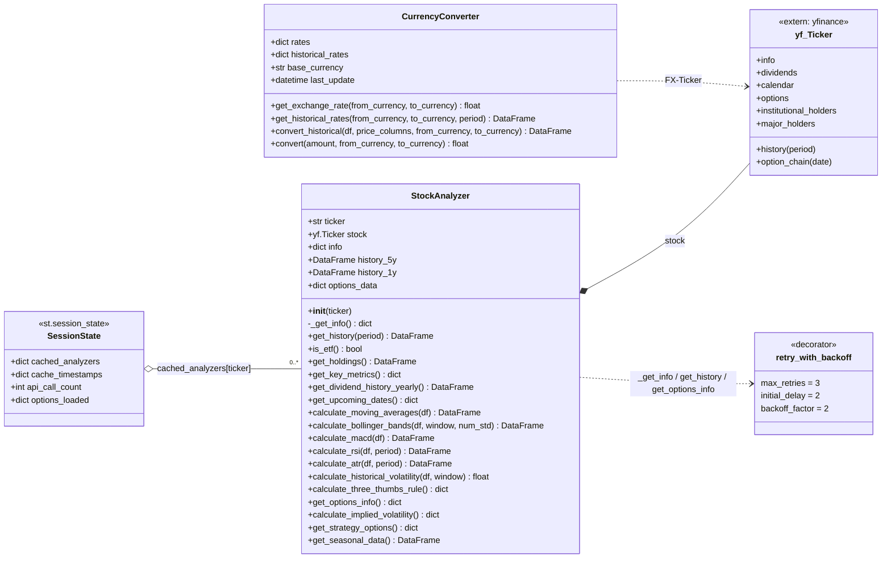
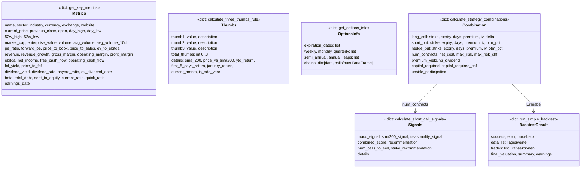
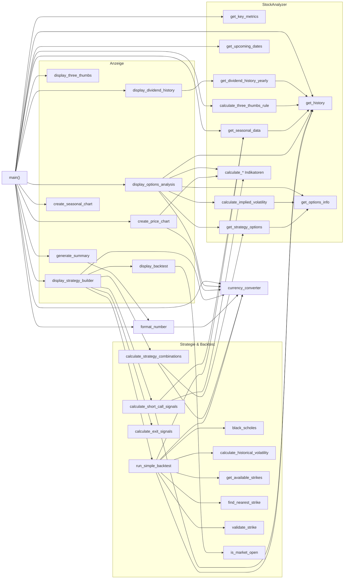
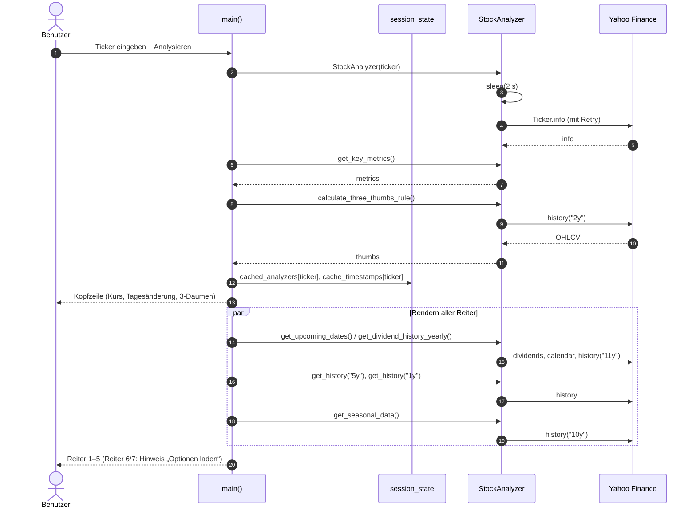
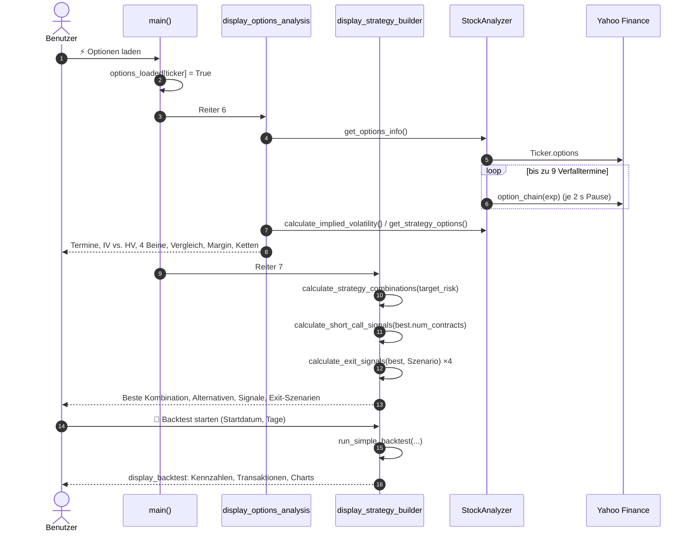
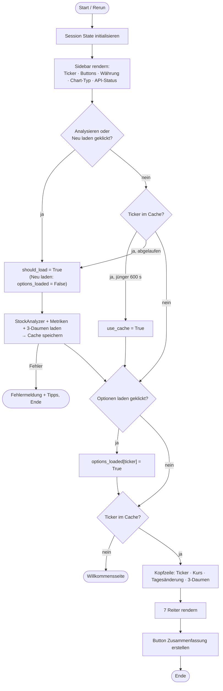

# 3. Klassen- und Funktionsdiagramme

## 3.1 Klassendiagramm

`currency_converter` ist eine **globale Singleton-Instanz** von `CurrencyConverter` auf Modulebene.

## 3.2 Datenstrukturen (Rückgabe-Dictionaries)

## 3.3 Funktionsübersicht (Aufrufgraph)

## 3.4 Sequenzdiagramm: „🔍 Analysieren“

## 3.5 Sequenzdiagramm: „⚡ Optionen laden“ und Strategie-Builder

## 3.6 Ablaufdiagramm `main()`

## 3.7 Funktionsreferenz

### Modulebene

| Funktion | Parameter | Rückgabe | Beschreibung |
|---|---|---|---|
| `retry_with_backoff` | `max_retries=3, initial_delay=2, backoff_factor=2` | Decorator | Wiederholt nur bei Rate-Limit-Fehlern |
| `format_number` | `value, format_type='number'\|'currency'\|'percent'\|'ratio', from_currency, to_currency, symbol` | `str` | Formatiert mit T/B/M-Suffix und Umrechnung |
| `format_price` | `value, from_currency, to_currency` | `str` | Kurzform Preisformat |
| `create_price_chart` | `df, title, show_candles, fx_rate, currency_symbol, source_currency, target_currency` | `go.Figure` | 4 bzw. 5 Panels: Kurs+BB+SMA, (FX), Volumen, MACD, RSI |
| `create_seasonal_chart` | `seasonal_data, ticker` | `go.Figure` | Ø-Wochenrendite und Anteil positiver Wochen |
| `display_three_thumbs` | `thumbs_result` | – | 4 Karten mit Daumen und Gesamtbewertung |
| `display_dividend_history` | `analyzer, source_currency, target_currency, curr_symbol` | – | Tabelle 10 Jahre, Einzelzahlungen, Ø-Rendite |
| `display_options_analysis` | `analyzer, metrics, source_currency, target_currency, curr_symbol` | – | Reiter 6 komplett |
| `generate_summary` | `analyzer, metrics, thumbs` | `str` | Text-Report zum Download |
| `calculate_strategy_combinations` | `analyzer, metrics, target_risk=5000, source_currency, target_currency` | `dict` | Top-5-Kombinationen (siehe 2.5.5) |
| `calculate_short_call_signals` | `analyzer, metrics, num_base_contracts=1` | `dict` | MACD/SMA200/Saison-Score (siehe 2.5.6) |
| `calculate_exit_signals` | `combination, current_price, original_price` | `dict` | Exit-Aktionen je Bein (siehe 2.5.7) |
| `black_scholes` | `S, K, T, r, sigma, option_type='call'\|'put'` | `float` | Optionspreis |
| `calculate_historical_volatility` | `prices: Series, window=30` | `float` | Vol p.a. dezimal, [0.05, 1.0] |
| `get_available_strikes` | `analyzer` | `list` | Strikes der Kette (siehe Einschränkung #2) |
| `find_nearest_strike` | `price, available_strikes, direction='above'\|'below'` | `float` | Nächster Strike bzw. Standardraster |
| `is_market_open` | – | `(bool, str)` | NYSE/NASDAQ 9:30–16:00 ET, Mo–Fr |
| `validate_strike` | `strike, available_strikes` | `(bool, float)` | Existenzprüfung + nächster Strike |
| `run_simple_backtest` | `analyzer, combination, start_date, num_days, current_price, source_currency, target_currency` | `dict` | Simulation (siehe 2.5.9) |
| `display_backtest` | `result, curr_symbol, target_currency` | – | Kennzahlen, Transaktionen, B&S-Schlussbewertung, Charts, Tageswerte |
| `display_strategy_builder` | `analyzer, metrics, source_currency, target_currency, curr_symbol` | – | Reiter 7 komplett |
| `main` | – | – | Einstiegspunkt |

### `StockAnalyzer`

| Methode | Yahoo-Zugriff | Rückgabe |
|---|---|---|
| `__init__(ticker)` | `info` (über `_get_info`) | – |
| `_get_info()` | `Ticker.info` (Retry) | `dict` |
| `get_history(period)` | `Ticker.history` (Retry) | OHLCV-`DataFrame` |
| `is_etf()` | – | `quoteType == 'ETF'` |
| `get_holdings()` | `institutional_holders` → `major_holders` → `info['holdings']` | `DataFrame` |
| `get_key_metrics()` | – (aus `info`) | `dict` (siehe 3.2) |
| `get_dividend_history_yearly()` | `dividends`, `history("11y")` | Jahr, Gesamt, Anzahl, Jahresanfangskurs, Rendite %, Einzelzahlungen |
| `get_upcoming_dates()` | `dividends`, `calendar` | Ex-Dividende und Earnings (ggf. geschätzt) |
| `calculate_*` (Indikatoren) | – | `DataFrame` mit zusätzlichen Spalten |
| `calculate_three_thumbs_rule()` | `history("2y")` | `dict` (siehe 3.2) |
| `get_options_info()` | `options`, `option_chain` ×≤9 (Retry) | `dict` (siehe 3.2) |
| `calculate_implied_volatility()` | über `get_options_info` | `avg_call_iv, avg_put_iv, atm_iv, iv_percentile` |
| `get_strategy_options()` | über `get_options_info` | 4 Beine mit `expiration, options, days` |
| `get_seasonal_data()` | `history("10y")` | Week, Avg_Return, Std_Return, Count, Avg_Return_Pct, Positive_Pct |
