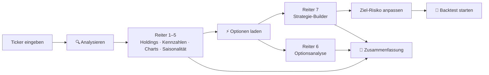

# 4. Bedienungsanleitung

## 4.1 Schnellstart

1. App öffnen (Streamlit-Cloud-URL oder lokal `http://localhost:8501`).
2. In der **Sidebar** ein **Ticker-Symbol** eingeben (z. B. `KO`, `AAPL`, `SPY`).
3. **🔍 Analysieren** klicken → Kopfzeile und Reiter 1–5 werden gefüllt.
4. Optional **⚡ Optionen laden** klicken → Reiter 6 (Optionsanalyse) und 7 (Strategie-Builder) werden aktiv.
5. Im Reiter **🎯 Strategie-Builder** das **Ziel-Risiko** einstellen und ggf. einen **Backtest** starten.
6. Unten auf der Seite **📄 Zusammenfassung erstellen** → Text kopieren oder als `.txt` herunterladen.



## 4.2 Bildschirmaufbau

```text
┌──────────────────────┬─────────────────────────────────────────────────────────────┐
│ ⚙️ Einstellungen      │ 📊 Aktienanalyse für Optionenstrategie                       │
│ [Ticker-Symbol    ]  │ ┌────────┬───────────────┬──────────────┬──────────┐         │
│ [🔍 Analysieren][🔄] │ │ Ticker │ Aktueller Kurs│ Tagesänderung│ 3-Daumen │         │
│ [⚡ Optionen laden ]  │ └────────┴───────────────┴──────────────┴──────────┘         │
│ ⚡ Optionen: …        │ 📁 Holdings │ 📊 Kennzahlen │ 📈 5J │ 📉 1J │ 🗓️ │ ⚡ │ 🎯      │
│ ─────────────        │ ┌─────────────────────────────────────────────────────────┐ │
│ 💱 Anzeigewährung ▼  │ │                 Inhalt des gewählten Reiters            │ │
│ 1 USD = x CHF        │ │                                                         │ │
│ Chart-Typ ◉Kerzen    │ └─────────────────────────────────────────────────────────┘ │
│ ℹ️ Über die Strategie │ [📄 Zusammenfassung erstellen]                               │
│ 📊 API Status         │                                                             │
└──────────────────────┴─────────────────────────────────────────────────────────────┘
```

## 4.3 Eingabefelder und Bedienelemente

### 4.3.1 Sidebar

| Element | Typ | Standard | Wertebereich | Wirkung |
|---|---|---|---|---|
| **Ticker-Symbol eingeben** | Textfeld | `KO` | Yahoo-Finance-Symbol, wird in Großbuchstaben umgewandelt | Basiswert der Analyse. Börsenzusätze nach Yahoo-Schema, z. B. `NESN.SW` (SIX), `SAP.DE` (Xetra) |
| **🔍 Analysieren** | Button (primär) | – | – | Lädt den Ticker neu (Info, Kennzahlen, 3-Daumen) und speichert ihn 10 Min. im Sitzungs-Cache |
| **🔄 Neu laden** | Button | – | – | Wie „Analysieren“, setzt zusätzlich den Status „Optionen geladen“ zurück |
| **⚡ Optionen laden** | Button | – | – | Schaltet Reiter 6 und 7 für den aktuellen Ticker frei (lädt Optionsketten) |
| Statuszeile „⚡ Optionen: …“ | Anzeige | – | Geladen / Nicht geladen | Zeigt, ob Optionsdaten für den Ticker aktiv sind |
| Cache-Hinweis „💾 Cache: n Min alt“ | Anzeige | – | 0–10 Min | Alter der gecachten Daten |
| **Anzeigewährung** | Auswahlliste | `CHF` | `CHF`, `USD`, `EUR` | Alle Beträge, Strikes, Prämien und Charts werden in diese Währung umgerechnet |
| „💹 1 USD = x …“ | Anzeige | – | – | Aktueller Wechselkurs (nur wenn ≠ USD) |
| **Chart-Typ** | Optionsfeld | `Kerzen` | `Kerzen`, `Linie` | Darstellung des Kurses in den Reitern 5 J / 1 J |
| **API Calls (Session)** | Kennzahl | 0 | – | Anzahl vollständiger Ladevorgänge; ab > 20 Warnhinweis |

> **Tipp:** Wenn der Ticker bereits im Cache ist und jünger als 10 Minuten, werden die Basisdaten
> beim Wechsel zwischen Tickern ohne Klick aus dem Cache angezeigt.

### 4.3.2 Reiter ⚡ Optionsanalyse

| Element | Typ | Standard | Wirkung |
|---|---|---|---|
| **⚡ Jetzt Optionen laden** | Button | – | Alternative zum Sidebar-Button (nur sichtbar, solange nicht geladen) |
| **Verfalltermin auswählen** | Auswahlliste | erster geladener Termin | Zeigt die vollständige Call- und Put-Kette dieses Termins |

### 4.3.3 Reiter 🎯 Strategie-Builder

| Element | Typ | Standard | Bereich / Schritt | Wirkung |
|---|---|---|---|---|
| **Ziel-Risiko (Währung)** | Zahlenfeld | 5 000 | 1 000 – 50 000, Schritt 1 000 | Maximales Verlustrisiko der Kombination; bestimmt die **Anzahl Kontrakte** |
| **⚡ Jetzt Optionen laden** | Button | – | – | wie oben |
| **Startdatum** | Datumsfeld | heute − 90 Tage | heute − 730 … heute − 7 Tage | Beginn des Backtest-Zeitraums |
| **Anzahl Tage** | Zahlenfeld | 60 | 7 – 365, Schritt 7 | Länge des Backtests in Kalendertagen |
| **🔄 Backtest starten** | Button (primär) | – | – | Führt den Backtest mit der **besten Kombination** aus |

### 4.3.4 Seitenende

| Element | Typ | Wirkung |
|---|---|---|
| **📄 Zusammenfassung erstellen** | Button | Erzeugt einen Textreport (Preisdaten, Bewertung, Dividende, Risiko, 3-Daumen, Strategieregeln) |
| **Zusammenfassung (kopieren oder speichern)** | Textbereich | Report zum Kopieren |
| **💾 Als Textdatei herunterladen** | Download-Button | Datei `TICKER_analyse_JJJJMMTT.txt` |

## 4.4 Die Reiter im Detail

### 📁 Holdings
* **ETF:** Bestandteile bzw. Haupteigner; falls nicht verfügbar Kategorie, Fondsfamilie, Gesamtvermögen, Kostenquote.
* **Einzelaktie:** Name, Sektor, Industrie, Börse, Währung, Website und aufklappbare Unternehmensbeschreibung.

### 📊 Kennzahlen
| Bereich | Inhalte | Interpretation |
|---|---|---|
| 3-Daumen-Regel | 3 Karten + Gesamtbewertung | 3/3 🟢 sehr gut, 2/3 🟡 gut, ≤ 1/3 🔴 Vorsicht |
| Wichtige Termine | Nächster Ex-Dividenden-Tag, nächster Earnings-Termin | Gelb = geschätzt (aus Zahlungsrhythmus bzw. +90 Tage) |
| 💰 Bewertung | Marktkapitalisierung, Umsatz TTM, P/E, Forward P/E, Price/Book | |
| 💵 Cash Flow | Free Cash Flow, FCF Yield, Price/FCF, Operating CF, EBITDA | |
| 📈 Dividende | Rendite, Dividende p.a., Ausschüttungsquote | |
| Dividenden-Historie | 10 Jahre: Summe je Jahr, Anzahl Zahlungen, Jahresanfangskurs, Rendite; Ø-Rendite | Rendite bezogen auf den **ersten Kurs des Jahres** |
| ⚠️ Risiko | Beta (0.8–1.2 = „Marktkonform“), Debt/Equity, Current Ratio, Quick Ratio | |

### 📈 Chart 5 Jahre / 📉 Chart 1 Jahr
* Panels: **Kurs** mit Bollinger-Bändern (20/2σ), SMA 50 und SMA 200 · **Wechselkurs** (nur wenn Anzeige- ≠ Handelswährung) · **Volumen** · **MACD** (12/26/9) · **RSI** (14, Linien bei 30 und 70).
* Bei Fremdwährung: Umrechnung mit dem **historischen Tageskurs**; rechte Achse zeigt die Originalwährung (gepunktet).
* 1-Jahres-Reiter zusätzlich: Gesamtrendite, Volatilität p.a., maximaler Drawdown, Sharpe Ratio (ohne risikolosen Zins).

### 🗓️ Saisonalität
* Ø-Rendite je Kalenderwoche über 10 Jahre und Anteil positiver Jahre.
* Top-5 beste / schlechteste Wochen, Hinweis zur aktuellen Kalenderwoche.

### ⚡ Optionsanalyse (nach „Optionen laden“)
1. **Verfügbare Termine** gruppiert nach Laufzeit (wöchentlich … LEAPS).
2. **Volatilität:** ATM-IV, HV 30 T, Ø Call-/Put-IV (±10 % um den Kurs), Bewertung IV vs. HV.
3. **Die 4 Strategiebeine** mit Top-5-Strikes und Empfehlung:

   | Bein | Strike-Fenster | Sortierung | Empfehlung |
   |---|---|---|---|
   | 1️⃣ Long Call 6–12 Mo | 90–105 % des Kurses | Open Interest | ATM / leicht ITM, hohe Liquidität |
   | 2️⃣ Short Put 12–24 Mo | 80–95 % | höchstes Bid | höchste Prämie |
   | 3️⃣ Hedge Put 3–6 Mo | 75–90 % | niedrigstes Ask | günstigste Absicherung |
   | 4️⃣ Short Call wöchentlich | Kurs + 1 ATR … Kurs + 3 ATR | höchstes Bid | Prämie |

4. **Strategievergleich** mit Netto-Credit/-Debit pro Aktie und pro Kontrakt.
5. **Margin- und Hebel-Schätzung:** Put-Margin ≈ 20 % des Kontraktwerts; Kapital bei Hebel 7 = Kontraktwert / 7.
6. **Optionsketten** für einen wählbaren Verfalltermin (Calls / Puts).

### 🎯 Strategie-Builder (nach „Optionen laden“)
1. **Beste Kombination:** Kontrakte, max. Risiko, Prämienrendite p.a. (vs. Dividende), Kurspartizipation (≈ Call-Delta).
2. **Komponentendetails** der drei Basisbeine und **Netto-Position** (Debit/Credit, Kapitalbindung, kontrollierter Wert, Hebel).
3. **Alternative Kombinationen** 2–5 (aufklappbar).
4. **Kurzfristige Call-Verkäufe:** MACD-, SMA200-, Saisonalitäts-Signal, Gesamt-Score, Empfehlung, Anzahl Kontrakte, Strike-Empfehlung.
5. **Wechsel- und Exit-Signale** für die Szenarien ±10 % / ±20 % und zeitbasierte Warnungen.
6. **Backtest** (Eingaben siehe 4.3.3). Ergebnis: Start/Ende, Strategie- vs. Aktienrendite, Investment, Endwert, Netto-Ergebnis, 30-T-Volatilität, Transaktionsliste, Black-Scholes-Schlussbewertung, Charts (Kurs mit Strike-Linien und Trades, Rendite, Volatilität), Tageswerte.

## 4.5 Wichtige Parameter (im Quellcode)

Diese Werte sind derzeit **Konstanten im Code** von `Simple_stock_analyzer_go.py` und nicht über die
Oberfläche änderbar.

### Infrastruktur

| Parameter | Wert | Ort | Bedeutung |
|---|---|---|---|
| `RATE_LIMIT_DELAY` | 2.0 s | Modulkopf | Pause vor jeder Yahoo-Anfrage |
| `MAX_RETRIES` | 3 | Modulkopf | Versuche bei Rate-Limit-Fehlern |
| `initial_delay` / `backoff_factor` | 2 s / ×2 | `retry_with_backoff` | Wartezeit zwischen Versuchen |
| `CACHE_TTL` | 600 s | Modulkopf | Gültigkeit des Sitzungs-Caches |
| FX-Cache | 3600 s | `CurrencyConverter.get_exchange_rate` | Gültigkeit aktueller Wechselkurse |
| Fallback-FX | USD→CHF 0.88, EUR→CHF 0.93, GBP→CHF 1.10, CHF→USD 1.14, CHF→EUR 1.08 | `CurrencyConverter` | wenn Yahoo keinen Kurs liefert |

### Analyse

| Parameter | Wert | Ort |
|---|---|---|
| SMA-Fenster | 20 / 50 / 200 | `calculate_moving_averages` |
| Bollinger | 20 Tage, 2 σ | `calculate_bollinger_bands` |
| MACD | 12 / 26 / 9 | `calculate_macd` |
| RSI | 14 | `calculate_rsi` |
| ATR | 14 | `calculate_atr` |
| Historische Volatilität | 30 Tage, ×√252 | `calculate_historical_volatility` |
| Saisonalität | 10 Jahre, ISO-KW | `get_seasonal_data` |
| Dividenden-Historie | 10 Jahre (Daten 11 J) | `get_dividend_history_yearly` |
| Plausibilitätsgrenze Dividendenrendite | 20 % | `get_key_metrics` |
| ATM-Band für IV | ±10 % | `calculate_implied_volatility` |
| IV-Prämie gut / schlecht | > +20 % / < −10 % | `display_options_analysis` |

### Strategie

| Parameter | Wert | Ort |
|---|---|---|
| Laufzeit-Kategorien | ≤14 / ≤45 / ≤180 / ≤365 / ≤730 / > 730 Tage | `get_options_info` |
| Kontraktgröße | 100 Aktien | überall |
| Long-Call-Fenster (Builder) | 95–105 %, Top 3 nach OI | `calculate_strategy_combinations` |
| Short-Put-Fenster (Builder) | 80–92 %, Top 3 nach Bid | `calculate_strategy_combinations` |
| Hedge-Put-Fenster (Builder) | 75–88 %, Top 3 nach Ask | `calculate_strategy_combinations` |
| Min. Laufzeit für Annualisierung | 30 Tage | `calculate_strategy_combinations` |
| Delta-Begrenzung Long Call | 0.3 – 0.8 | `calculate_strategy_combinations` |
| Signalgewichte MACD / SMA200 / Saison | 0.40 / 0.35 / 0.25 | `calculate_short_call_signals` |
| Score-Schwellen | 0.5 / 0.2 / 0 / −0.3 | `calculate_short_call_signals` |
| Short-Call-Abdeckung | 50 % der Basiskontrakte | `calculate_short_call_signals` |
| Strike-Abstand Short Call | 1.0 / 1.5 / 2.0 ATR | `calculate_short_call_signals` |
| Put-Margin-Schätzung | 20 % | `display_options_analysis` |
| Ziel-Hebel | 7 | `display_options_analysis` |

### Backtest

| Parameter | Wert | Ort |
|---|---|---|
| Risikoloser Zins | 4 % | `run_simple_backtest` |
| Short-Call-Laufzeit | 5 Tage | `run_simple_backtest` |
| Short-Call-Strike | nächster Strike ≥ Kurs · 1.015 | `run_simple_backtest` |
| Basis-Score / Saison-Anpassung | 0.2 / +0.3 bzw. −0.2 bei Ø-KW-Rendite < −0.3 % bzw. > +0.3 % | `run_simple_backtest` |
| Datenbasis | 2 Jahre Historie | `run_simple_backtest` |
| Börsenzeiten | Mo–Fr 9:30–16:00 US/Eastern | `is_market_open` |

## 4.6 Typische Arbeitsabläufe

**Wöchentliche Prüfung der Short Calls**
1. Ticker analysieren → 3-Daumen und Saisonalität der aktuellen KW ansehen.
2. Optionen laden → Strategie-Builder → Abschnitt „Kurzfristige Call-Verkäufe“.
3. Empfehlung und Strike-Empfehlung mit der wöchentlichen Kette (Reiter 6, Bein 4️⃣) abgleichen.

**Neuen Basiswert bewerten**
1. Kennzahlen (FCF, Verschuldung, Dividendenhistorie) und 3-Daumen-Regel prüfen.
2. Optionsanalyse: Liquidität (Open Interest) und IV vs. HV prüfen.
3. Strategie-Builder mit passendem Ziel-Risiko, anschließend Backtest über mehrere Zeiträume.
4. Zusammenfassung herunterladen.

## 4.7 Fehlerbehebung

| Meldung / Symptom | Ursache | Lösung |
|---|---|---|
| „⏳ Rate Limit erreicht …“ / „Rate Limit überschritten“ | Zu viele Anfragen an Yahoo | 1–2 Minuten warten; „Analysieren“ statt „Neu laden“ verwenden; Optionen nur bei Bedarf laden |
| „Keine historischen Daten …“ | Falsches Symbol oder Börsenzusatz fehlt | Symbol auf finance.yahoo.com prüfen (z. B. `NESN.SW`) |
| „Keine Optionsdaten verfügbar“ | Für den Wert gibt es bei Yahoo keine Optionen (z. B. viele europäische Aktien) | US-gelisteten Wert bzw. ADR verwenden |
| „Keine geeigneten Optionskombinationen gefunden“ | Eine benötigte Laufzeit (3–6, 6–12 oder 12–24 Mo) oder Strikes im Fenster fehlen | Anderen, liquideren Basiswert wählen |
| Warnung „Börse geschlossen …“ im Backtest | Außerhalb der US-Handelszeiten sind Bid/Ask oft 0 oder veraltet | Während der Handelszeit (15:30–22:00 MEZ) erneut laden |
| Seite lädt lange | Jede Interaktion lädt Kurshistorien/Optionsketten neu (2 s Pause je Anfrage) | Geduld; siehe [Bekannte Einschränkungen](02_Software_Design.md#28-bekannte-einschränkungen-und-verbesserungspotenzial) |
| Wechselkurs wirkt veraltet | Yahoo nicht erreichbar → Fallback-Kurse | Später „Neu laden“ |
