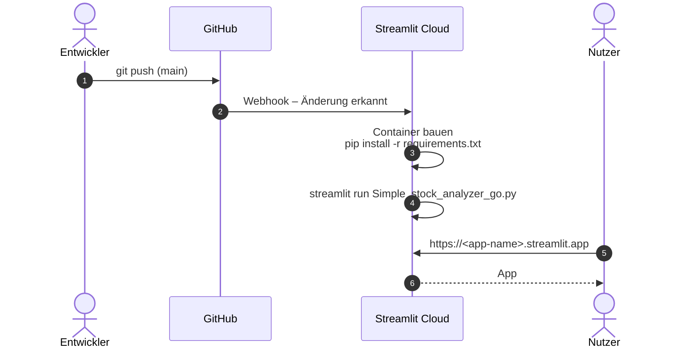
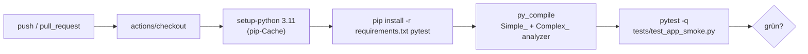

# 5. Cloud-Deployment und Betrieb

Das Repository ist so aufgebaut, dass es ohne Anpassungen auf **Streamlit Community Cloud** und in
**GitHub Codespaces** läuft. Secrets oder API-Keys werden nicht benötigt.

## 5.1 Relevante Dateien

| Datei | Zweck |
|---|---|
| `Simple_stock_analyzer_go.py` | Einstiegspunkt der App (Main file path) |
| `requirements.txt` | Wird von Streamlit Cloud und Codespaces automatisch installiert |
| `.streamlit/config.toml` | Server- und Theme-Einstellungen (headless, keine Telemetrie, helles Theme) |
| `.devcontainer/devcontainer.json` | Codespaces: Python 3.11, installiert Abhängigkeiten, startet die App auf Port 8501 |
| `.github/workflows/ci.yml` | GitHub Actions: Syntax-Check und Smoke-Tests bei jedem Push / PR |
| `tests/test_app_smoke.py` | Startet die App headless (Streamlit `AppTest`) und prüft Widgets + Black-Scholes |
| `.gitignore` | Schließt `venv/`, Caches und `.streamlit/secrets.toml` aus |
| `deploy.sh` | Commit + Push der App-Dateien und Hinweise für Streamlit Cloud |

## 5.2 Streamlit Community Cloud



### Erstmaliges Einrichten
1. Auf <https://share.streamlit.io> mit dem GitHub-Konto anmelden.
2. **Create app** → **Deploy a public app from GitHub**.
3. Eintragen:

   | Feld | Wert |
   |---|---|
   | Repository | `ernoe99/Aktienanalyse_1` |
   | Branch | `main` |
   | Main file path | `Simple_stock_analyzer_go.py` |
   | App URL | frei wählbar, z. B. `aktienanalyse-optionen` |

4. Unter **Advanced settings** Python **3.11** wählen (entspricht Codespaces und CI). Secrets: keine.
5. **Deploy** – der erste Build dauert einige Minuten.

### Aktualisieren
Jeder Push auf den konfigurierten Branch wird automatisch neu ausgerollt. Alternativ:

```bash
./deploy.sh "Beschreibung der Änderung"
```

### Betriebshinweise
* Apps im Gratis-Tarif **schlafen nach längerer Inaktivität** ein; der erste Aufruf weckt sie (Wartezeit).
* Streamlit Cloud nutzt **gemeinsame ausgehende IP-Adressen** – Yahoo-Rate-Limits treten daher früher auf
  als lokal. Den Sitzungs-Cache nutzen („Analysieren“ statt „Neu laden“) und Optionen nur bei Bedarf laden.
* Die Sichtbarkeit der App (öffentlich / nur eingeladene Personen) wird in den App-Einstellungen unter
  **Sharing** festgelegt.
* Logs: Im App-Menü **Manage app** → Konsole unten rechts.

## 5.3 GitHub Codespaces

1. Im Repository auf GitHub **Code → Codespaces → Create codespace on main**.
2. Der Dev Container installiert `requirements.txt` und startet automatisch
   `streamlit run Simple_stock_analyzer_go.py`.
3. Port **8501** wird weitergeleitet und als Vorschau geöffnet.

## 5.4 Lokaler Betrieb

```bash
git clone https://github.com/ernoe99/Aktienanalyse_1.git
cd Aktienanalyse_1
./start_analyzer.sh          # legt venv an, installiert, startet auf Port 8501
./start_analyzer.sh 8502     # anderer Port
```

Manuell:

```bash
python3 -m venv venv
source venv/bin/activate
pip install -r requirements.txt
streamlit run Simple_stock_analyzer_go.py
```

Ausführliche Anleitung für Ubuntu: [INSTALLATION_UBUNTU.md](../INSTALLATION_UBUNTU.md).

## 5.5 Continuous Integration



Tests lokal ausführen:

```bash
pip install pytest
pytest -q
```

Die Smoke-Tests benötigen **keinen** Zugriff auf Yahoo Finance: Sie prüfen, dass die App ohne Ausnahme
startet, die Sidebar-Widgets mit den erwarteten Standardwerten vorhanden sind und dass `black_scholes` die
Put-Call-Parität erfüllt.

## 5.6 Alternative App-Version

`Complex_system_analyzer_go.py` (Version 3.0, variable Strike-Prozente und Strategievergleich) kann als
**zweite App** aus demselben Repository deployt werden: In Streamlit Cloud eine weitere App anlegen und als
Main file path `Complex_system_analyzer_go.py` angeben.
