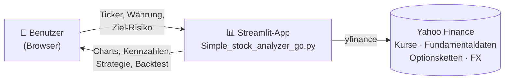

# 📚 Dokumentation – Aktienanalyse für Optionenstrategie

Dokumentation zur aktiven Version **2.9** (`Simple_stock_analyzer_go.py`).

| Nr. | Dokument | Inhalt |
|---|---|---|
| 1 | [Systemarchitektur](01_Systemarchitektur.md) | Systemkontext, Komponenten, Deployment-Varianten, Datenfluss, Caching und Rate Limiting |
| 2 | [Software Design](02_Software_Design.md) | Modulaufbau, Designentscheidungen, Zustandsverwaltung, Fehlerbehandlung, Algorithmen und Formeln |
| 3 | [Klassen- und Funktionsdiagramme](03_Klassen_und_Funktionsdiagramme.md) | UML-Klassendiagramm, Aufrufgraphen, Sequenz- und Ablaufdiagramme, Funktionsreferenz |
| 4 | [Bedienungsanleitung](04_Bedienungsanleitung.md) | Handhabung, alle Eingabefelder, Reiter, Parameter und Schwellenwerte |
| 5 | [Cloud-Deployment](05_Cloud_Deployment.md) | Streamlit Community Cloud, GitHub Codespaces, CI, lokaler Betrieb |

Die Diagramme sind in [Mermaid](https://mermaid.js.org/) geschrieben und werden von GitHub direkt
als Grafik angezeigt.

## Kurzüberblick



## Repository-Struktur

```text
Aktienanalyse_1/
├── Simple_stock_analyzer_go.py   # ⭐ Hauptanwendung v2.9 (Einstiegspunkt Cloud)
├── Complex_system_analyzer_go.py # Alternative v3.0 (variable Strike-Prozente)
├── requirements.txt              # Python-Abhängigkeiten (Cloud-Build)
├── .streamlit/config.toml        # Streamlit-Konfiguration (Server, Theme)
├── .devcontainer/                # GitHub Codespaces / VS Code Dev Container
├── .github/workflows/ci.yml      # CI: Syntax-Check + Smoke-Tests
├── tests/                        # pytest Smoke-Tests (Streamlit AppTest)
├── docs/                         # 📚 diese Dokumentation
├── legacy/                       # frühere Versionen (1.0 – 3.0), nicht deployt
├── start_analyzer.sh             # lokales Startskript (venv + Start)
├── deploy.sh                     # Commit + Push + Hinweise Streamlit Cloud
├── doit                          # Kurzanleitung Installation (Shell-Befehle)
├── INSTALLATION_UBUNTU.md        # ausführliche Ubuntu-Installation
└── README.md
```

> ⚠️ **Disclaimer:** Die Software dient ausschließlich Informationszwecken und ist keine Anlageberatung.
> Optionshandel – insbesondere mit Hebel – ist mit erheblichen Verlustrisiken verbunden.
